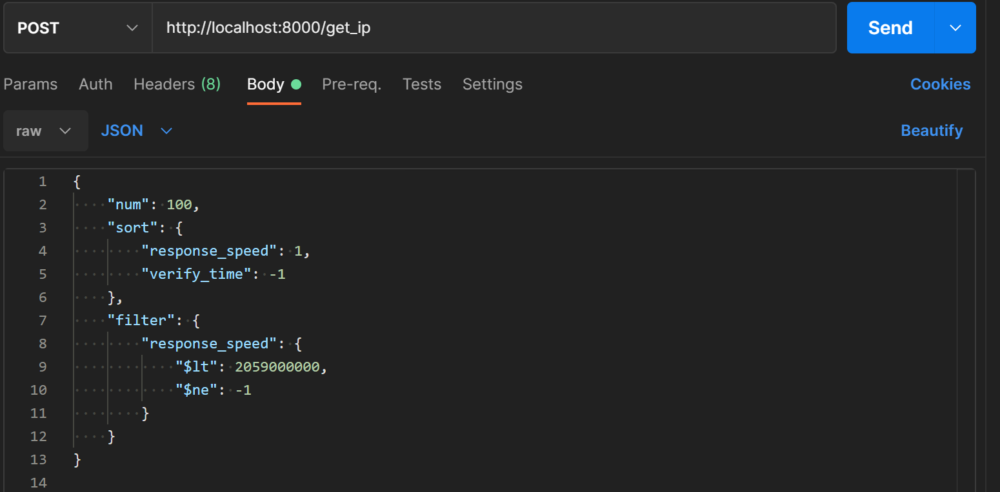

# IPProxy

目前项目中使用的代理网站有：

- [x] 小幻代理  ~~https://ip.ihuan.me/(暂未实现多页爬取)~~
- [x] 89免费代理  https://www.89ip.cn/
- [x] 高可用全球免费代理IP库 https://ip.jiangxianli.com/
- [x] 66免费代理  http://www.66ip.cn/
- [x] 云代理  ~~http://www.ip3366.net/(不可用)~~
- [x] 企业级高速HTTP代理平台  ~~http://www.data5u.com/(不可用)~~
- [x] 极速代理  https://superfastip.com/#/freeip
- [x] 开心代理 http://www.kxdaili.com/dailiip.html
- [x] 西拉代理  http://www.xiladaili.com/
- [x] 全网代理IP  http://www.goubanjia.com/


项目中提供获取IP地址的接口为 POST `/get_ip`，使用的参数如下

```go
type param struct {
	Num int64 `form:"num"`  // 数量
	Sort bson.M `form:"sort"` // 排序方式，与mongodb中的一致
	Filter bson.M `form:"filter"`  // 过滤条件，和mongodb的过滤一致
}
```

使用`Postman`测试如下



> :star:**强烈建立在使用的时候参数在上述的sort和filter参数进行扩展，以免获取到的IP可用率比较低**


配置文件如下

```yaml
# 数据库配置
database:
  mongodb:
    username: "Edgar"  # 数据库用户名
    password: "Edgar"  # 密码
    db: "IP"  # 数据库名称
    collection: "ip"  # 保存爬取到的ip集合
    host: "127.0.0.1" # 数据库主机号
    port: "27017" # 数据库端口

# 日志配置
log:
  mode: "console"  # console 或者 file，只有设置mode为file的时候filename才生效
  level: "info" # 或者 debug, trace, warning, error
  filename: "proxy.log" # 日志文件名
  max-size: 5  # MB为单位，当文件达到这个大小之后更换另一个日志文件，暂无实现

# 定时任务配置
schedule:
  interval: 10  # 以小时为单位，管理定时任务

# 接口配置
api:
  host: "127.0.0.1"
  port: "8000"
```


如果需要使用二进制文件比如`proxy_server.exe`，请在与`proxy_server.exe`同目录下新建一个上述格式的配置文件，命名必须为`config.yaml`

如下图格式，然后在当前目录下运行`proxy_server.exe`即可


#### LICENSE

开源免费使用，本人不承担任何因此造成的法律责任